# Báo cáo Căn cứ Phân tích Đính chính Thứ bậc Phân tầng Nguy cơ RQ2 (RQ2 Hierarchy Erratum & Clarification Brief)

- **Tài liệu:** Báo cáo Phân tích Đính chính Thứ bậc Phân tầng Nguy cơ cho Câu hỏi Nghiên cứu RQ2 (RQ2 Hierarchy Erratum & Clarification Brief)
- **Dự án:** SafeShift: Benchmarking Cross-Domain Generalization and Evidence Grounding in Vision-Language Models for Industrial Safety Assessment
- **Bộ dữ liệu:** InspecSafe-V1 (5.013 mẫu ảnh: 4.013 Normal, 1.000 Anomaly)
- **Nhánh Git:** `protocol/rq2-hierarchy-erratum`
- **Trạng thái:** **BÁO CÁO PHÂN TÍCH ĐỀ XUẤT (PROPOSED, NOT APPROVED)** — Đang chờ phê duyệt chính thức từ Research Lead / Project Owner
- **Ngày lập:** 2026-09-18
- **Phiên bản:** 1.0.0

---

> [!IMPORTANT]
> **VỊ TRÍ PHƯƠNG PHÁP LUẬN VÀ GIỚI HẠN PHẠM VI CỦA TÀI LIỆU:**  
> 1. Tài liệu này là **Báo cáo phân tích chuyên sâu (Analysis Brief Only)** nhằm xác định, làm rõ và đề xuất phương án giải quyết dứt điểm mâu thuẫn ngữ nghĩa về thứ bậc phân tầng nguy cơ trong câu hỏi nghiên cứu RQ2 giữa các quyết định đã được phê duyệt D5 ([DEC-W2-D5-005](../DECISIONS.md#dec-w2-d5-005)) và D6 ([DEC-W2-D6-006](../DECISIONS.md#dec-w2-d6-006)).  
> 2. Tài liệu này ở trạng thái **`PROPOSED, NOT APPROVED`**.  
> 3. **TUYỆT ĐỐI KHÔNG SỬA ĐỔI `DECISIONS.md`** tại bước này. Mọi thay đổi vào văn kiện quyết định chính thức chỉ được thực hiện sau khi Research Lead phê duyệt rõ ràng câu hỏi tại Mục 13.  
> 4. **TUYỆT ĐỐI KHÔNG THỰC HIỆN SUY LUẬN VLM (VLM INFERENCE)** hoặc gọi API thương mại trong tài liệu này.  
> 5. Giữ nguyên 100% các quyết định kỹ thuật nền tảng: Giao thức Grounding RQ3-A / RQ3-B từ D6/D5, Định dạng Bounding Box D4, Cơ chế Ghép cặp Mode A / Mode B D5, Chỉ số CGI, và Phương pháp Bootstrap lấy mẫu lại cụm.

---

## 1. Vấn đề mâu thuẫn phương pháp luận (Problem Statement)

Trong hệ thống tài liệu và văn bản quyết định hiện hành của SafeShift (sau khi hoàn thành W2.4 với PR #14 tại commit `0e460661b1cf2ecbb4d1734d38b058c92e8ac47b`), tồn tại một **mâu thuẫn ngữ nghĩa (semantic inconsistency)** và **sự sai lệch về thứ bậc phân tầng nghiên cứu (hierarchy misalignment)** đối với Câu hỏi Nghiên cứu 2 (RQ2).

### 1.1 Tuyên bố mục tiêu ban đầu của RQ2 tại D1
Tại quyết định nền tảng [DEC-W2-D1-001](../DECISIONS.md#dec-w2-d1-001) và tài liệu căn cứ [notes/w2_protocol_decision_brief.md](w2_protocol_decision_brief.md#112-research-question-2-rq2), RQ2 được định nghĩa chuẩn xác bằng tiếng Anh:
> *"RQ2: Which safety levels and **verified hazard strata** show the largest error concentration in frozen VLM predictions, and to what extent is this error pattern associated with hazard visibility or sample scarcity?"*

Tài liệu D1 ghi chú rõ ràng rằng danh mục phân tầng nguy cơ đã xác minh (*verified hazard strata*) chưa được chốt tại W2.1 mà phải phụ thuộc vào kết quả của **Cuộc tổng điều tra nguy cơ D6 (Census D6)** ở giai đoạn tiếp theo.

### 1.2 Thực trạng mâu thuẫn phát sinh giữa D5 và D6
Khi hoàn thiện cuộc tổng điều tra tại W2.3 (D6) và xây dựng hệ thống chỉ số tại W2.4 (D5):
1. **D6 đã thẩm định và xác lập hệ thống 12 Nguy cơ Nguyên tử (`Hazard Atoms`):** Đây là hệ thống phân loại duy nhất phản ánh trung thực nhãn gốc, giải thích 100% (1.000 / 1.000) mẫu Bất thường, bao gồm 1.788 lượt xuất hiện của nguy cơ nguyên tử.
2. **Tuy nhiên, D6 cũng đề xuất thêm "7 Phân tầng Nguy cơ Gom nhóm Ứng viên" (`Candidate Grouped Hazard Strata A–G`):** Các nhóm này được xây dựng như một cách tiếp cận phân nhóm cấp cao (coarse-grained grouping) nhằm quan sát xu hướng tổng thể.
3. **D5 đã gán toàn bộ định nghĩa chỉ số RQ2 vào 7 nhóm gom A–G này:** Quyết định D5 (mục DEC-W2-D5-005) định nghĩa hệ thống 4 chỉ số cốt lõi của RQ2 (`RQ2 Grouped Hazard Strata Metrics`) và chỉ quy định tính toán trên 7 nhóm A–G. 
4. **Hệ quả tiêu cực:** Cách trình bày này đã vô tình tạo ra một ngụ ý sai lệch rằng: **7 nhóm gom A–G là các phân tầng chính (Primary Strata) của RQ2**, trong khi **12 nguy cơ nguyên tử bị đẩy xuống hàng thứ yếu hoặc bị bỏ sót hoàn toàn trong báo cáo định lượng RQ2**.

---

## 2. Kiểm kê các bản ghi mâu thuẫn hiện hành (Current Contradictory Records)

Việc rà soát toàn diện mã nguồn tài liệu xác định các vị trí cụ thể trong repository đang tạo ra ấn tượng sai lệch về thứ bậc RQ2:

### 2.1 Trong `DECISIONS.md`
- **DEC-W2-D5-005 (Metrics & Statistical Evaluation Protocol):**
  - *Dòng 379:* *"Phê chuẩn hệ thống chỉ số phân tầng nguy cơ RQ2 trên 7 tầng nguy cơ gom nhóm (Candidate Grouped Hazard Strata) và quy tắc phương pháp luận kiểm soát hiện tượng chồng lấn đa nguy cơ (Multi-Stratum Overlap)."* $\rightarrow$ Hoàn toàn không nhắc tới việc đánh giá trên 12 Hazard Atoms.
  - *Dòng 457–463 (Mục Quyết định 6):* Tiêu đề ghi: *"6. Phê duyệt Hệ thống Chỉ số Phân tầng Nguy cơ RQ2 (RQ2 Grouped Hazard Strata Metrics)"*, quy định: *"Đánh giá trên đúng 7 tầng nguy cơ gom nhóm ứng viên (Candidate Grouped Hazard Strata A–G) đã khóa tại D6. Đối với mỗi stratum $s \in \{\text{Strata A}, \dots, \text{Strata G}\}$ gồm $N_s$ mẫu, báo cáo bộ 4 chỉ số an toàn..."* $\rightarrow$ Đồng nhất hóa đối tượng duy nhất của RQ2 là 7 nhóm A–G.
  - *Dòng 465:* Ghi nhận 1.381 lượt thành viên trên 1.000 mẫu ảnh nhưng chỉ gắn với 7 nhóm gom.
- **DEC-W2-D6-006 (Hazard Taxonomy and Grounding Support Census):**
  - *Dòng 618:* *"Phê chuẩn 7 phân tầng nguy cơ gom nhóm ứng viên (Candidate Grouped Hazard Strata) cho câu hỏi nghiên cứu RQ2 cùng các cảnh báo về yếu tố gây nhiễu."*
  - *Dòng 690–691 (Mục Quyết định 5):* Tiêu đề ghi: *"5. Phê duyệt 7 Candidate Grouped Hazard Strata cho RQ2: Phê chuẩn 7 tầng nguy cơ gom nhóm ứng viên (Candidate Grouped Hazard Strata) phục vụ phân tích tập trung lỗi của RQ2: A. FIRE_AND_SMOKE... B. PPE_ABSENCE..."* $\rightarrow$ Đặt tên 7 nhóm này trực tiếp làm đại diện phân tầng cho RQ2.

### 2.2 Trong `notes/w2_metrics_statistics_decision_brief.md` (D5 Brief)
- *Dòng 67:* *"RQ2 Phân rã sai số an toàn theo 7 phân tầng nguy cơ gom nhóm ứng viên (Candidate Grouped Hazard Strata A–G)"*.
- *Dòng 318 (Mục 9):* Tiêu đề: *"Chỉ số phân tầng nguy cơ RQ2 (RQ2 Hazard Strata Metrics)"* quy định độc quyền tính toán bộ 4 chỉ số trên 7 grouped strata.
- *Dòng 794, 826, 891:* Lặp lại cấu trúc 7 grouped strata như là phân tầng duy nhất của RQ2 khi đối chiếu với các mô hình baseline.

### 2.3 Trong `notes/w2_grounding_census_decision_brief.md` (D6 Brief)
- *Dòng 344–346 (Mục 11):* Tiêu đề: *"11. Các tầng nguy cơ gom nhóm ứng viên cho RQ2 (Candidate Grouped Hazard Strata)"*, diễn giải: *"Câu hỏi nghiên cứu RQ2 yêu cầu phân tích sự tập trung lỗi của mô hình VLM theo các phân tầng nguy cơ. Dựa trên 12 verified hazard atoms, SafeShift đề xuất 7 Phân tầng Nguy cơ Gom nhóm Ứng viên..."*.
- *Dòng 585 (Mục 14 Q4):* Câu hỏi biểu quyết hỏi về việc phê duyệt 7 nhóm này làm strata cho RQ2.

---

## 3. Tầm quan trọng phương pháp luận của việc phân định (Why the Distinction Matters)

Việc phân định rạch ròi giữa **12 Hazard Atoms (Primary)** và **7 Grouped Strata (Secondary)** không đơn thuần là thay đổi câu chữ, mà là một nguyên tắc sống còn về tính toàn vẹn khoa học của bài báo và benchmark:

### 3.1 12 Hazard Atoms là Hệ Phân loại Ground-Truth Trung thực Duy nhất
- **Nguồn gốc thực chứng:** 12 Hazard Atoms được chiết xuất tất định từ 187 mệnh đề nguy cơ gốc và đối chiếu trực tiếp với hệ quy chuẩn 5 ngành công nghiệp của InspecSafe-V1.
- **Tính bao phủ toàn diện:** 12 Hazard Atoms giải thích trọn vẹn 100% (1.000 / 1.000) mẫu Anomaly, không để sót bất kỳ mẫu nào (`unmapped_count = 0`).
- **Tính nguyên tử:** Mỗi atom đại diện cho một vi phạm an toàn cụ thể, độc lập về mặt ngữ nghĩa (ví dụ: `NO_HELMET` là thiếu mũ, `USE_MOBILE_PHONE` là dùng điện thoại).

### 3.2 7 Nhóm Gom A–G là Cấu trúc Phái sinh Cấp cao (Derived Coarse Grouping)
- 7 nhóm gom là sản phẩm tổng hợp nhân tạo phục vụ tóm tắt trực quan, **không phải là nhãn ground truth có sẵn trong tập dữ liệu**.
- 7 nhóm gom tạo ra **1.381 lượt thành viên (memberships)** trên 1.000 mẫu Anomaly, nghĩa là mức độ trùng lặp và phụ thuộc thống kê rất cao.
- **Làm lu mờ độ phân giải chẩn đoán an toàn (Loss of Diagnostic Granularity):**
  - *Ví dụ về PPE (Nhóm B - `PPE_ABSENCE`):* Nếu gộp chung `NO_HELMET`, `NO_GLOVES` và `NO_MASK` vào Nhóm B ($N=545$ mẫu, 882 atoms), ta không thể biết được mô hình VLM thường xuyên bỏ sót vi phạm mũ bảo hộ (tín hiệu ở vùng đầu) hay vi phạm găng tay (tín hiệu ở bàn tay nhỏ và dễ bị che khuất).
  - *Ví dụ về Cháy/Nhiệt (Nhóm A - `FIRE_AND_SMOKE`):* Gộp `OPEN_FLAME` ($N=117$) và `SMOKE` ($N=108$) sẽ xóa nhòa sự khác biệt giữa phát hiện ngọn lửa (đặc trưng màu sắc/độ sáng nổi bật) và phát hiện khói (đặc trưng bán trong suốt, biên mờ).
  - *Ví dụ về Hành vi/Vật thể (Nhóm C - `UNAUTHORIZED_BEHAVIOR` vs Nhóm E - `OBSTRUCTION_AND_FOREIGN_OBJECT`):* Khiến cho việc so sánh khả năng nhận diện vật thể ngoại lai (`FOREIGN_OBJECT`) và nhận diện vi phạm quy tắc vận hành bị phân tán.

### 3.3 Yêu cầu khắt khe về Đánh giá An toàn Công nghiệp
Trong kiểm định an toàn công nghiệp thực tế, một hệ thống AI không thể chỉ báo cáo "phát hiện lỗi PPE chung chung" mà phải chỉ rõ loại vi phạm để kích hoạt quy trình ứng phó tương ứng. Do đó, việc đặt 12 Hazard Atoms làm phân tầng chính là yêu cầu bắt buộc để benchmark SafeShift có giá trị thực tiễn và tính học thuật cao.

---

## 4. Thứ bậc phân tầng chính thống đề xuất (Proposed Authoritative Hierarchy)

SafeShift xác lập lại thứ bậc phân tầng chính thống hai cấp độ cho câu hỏi nghiên cứu RQ2:

```mermaid
graph TD
    subgraph PrimaryRQ2 ["TẦNG PHÂN TÍCH CHÍNH (PRIMARY RQ2 STRATA) - 12 HAZARD ATOMS"]
        A1["NO_GLOVES (N=453)"]
        A2["NO_HELMET (N=229)"]
        A3["NO_MASK (N=200)"]
        A4["USE_MOBILE_PHONE (N=167)"]
        A5["LIQUID_ON_GROUND (N=134)"]
        A6["SMOKING (N=120)"]
        A7["OPEN_FLAME (N=117)"]
        A8["FOREIGN_OBJECT (N=115)"]
        A9["SMOKE (N=108)"]
        A10["NONMOTORIZED_VEHICLE (N=101)"]
        A11["DOOR_OPEN (N=34)"]
        A12["PERSON_FALLEN (N=10)"]
    end

    subgraph SecondaryRQ2 ["TẦNG TÓM TẮT KHÁM PHÁ PHỤ TRỢ (SECONDARY EXPLORATORY SUMMARIES) - 7 GROUPS"]
        G1["Group A: FIRE_AND_SMOKE (Sample N=200, Atom N=225)"]
        G2["Group B: PPE_ABSENCE (Sample N=545, Atom N=882)"]
        G3["Group C: UNAUTHORIZED_BEHAVIOR (Sample N=247, Atom N=287)"]
        G4["Group D: ENVIRONMENTAL_SLIP_HAZARD (Sample N=134, Atom N=134)"]
        G5["Group E: OBSTRUCTION_AND_FOREIGN_OBJECT (Sample N=211, Atom N=216)"]
        G6["Group F: EQUIPMENT_STATE_ANOMALY (Sample N=34, Atom N=34)"]
        G7["Group G: PERSONNEL_FALLEN (Sample N=10, Atom N=10)"]
    end

    A7 --> G1
    A9 --> G1
    A1 --> G2
    A2 --> G2
    A3 --> G2
    A4 --> G3
    A6 --> G3
    A5 --> G4
    A8 --> G5
    A10 --> G5
    A11 --> G6
    A12 --> G7
```

### 4.1 Phân tầng Chính (Primary RQ2 Strata): 12 Hazard Atoms
- **Đối tượng:** Đúng **12 Hazard Atoms** đã kiểm toán tại D6, giải thích 100% 1.000 mẫu Anomaly (tổng cộng 1.788 atoms).
- **Quy mô mẫu theo Atom và theo Mẫu ảnh chứa Atom:**
  1. `NO_GLOVES`: 453 atoms (phân bố trên các mẫu chứa vi phạm không đeo găng tay).
  2. `NO_HELMET`: 229 atoms (phân bố trên các mẫu chứa vi phạm không đội mũ).
  3. `NO_MASK`: 200 atoms (phân bố trên các mẫu chứa vi phạm không đeo khẩu trang).
  4. `USE_MOBILE_PHONE`: 167 atoms (phân bố trên các mẫu dùng điện thoại).
  5. `LIQUID_ON_GROUND`: 134 atoms (phân bố trên các mẫu tràn dầu/đọng nước).
  6. `SMOKING`: 120 atoms (phân bố trên các mẫu hút thuốc).
  7. `OPEN_FLAME`: 117 atoms (phân bố trên các mẫu ngọn lửa trần).
  8. `FOREIGN_OBJECT`: 115 atoms (phân bố trên các mẫu có dị vật/rác).
  9. `SMOKE`: 108 atoms (phân bố trên các mẫu có khói).
  10. `NONMOTORIZED_VEHICLE`: 101 atoms (phân bố trên các mẫu xe thô sơ lấn làn).
  11. `DOOR_OPEN`: 34 atoms (phân bố trên các mẫu cửa tủ điện mở).
  12. `PERSON_FALLEN`: 10 atoms (phân bố trên các mẫu người ngã gục).
- **Vai trò:** Là mỏ neo đánh giá chính thức bắt buộc trong toàn bộ các bảng kết quả chính của RQ2.

### 4.2 Phân tầng Khám phá Phụ trợ (Secondary Exploratory Summaries): 7 Grouped Categories A–G
- **Đối tượng:** 7 nhóm gom ứng viên A–G đã định nghĩa tại D6/D5.
- **Bản chất:** Là công cụ tóm tắt trực quan cấp cao (roll-up summary view), hỗ trợ quan sát nhanh các khối nguy cơ vĩ mô.
- **Quy tắc diễn giải:** Báo cáo phụ trợ, không thay thế bảng kết quả 12-atom, bắt buộc đi kèm cảnh báo về tính chồng lấn (1.381 memberships) và không cộng dồn.

---

## 5. Phân tích RQ2 trên 12 Hazard Atoms chính (Primary 12-Atom RQ2 Analysis)

### 5.1 Áp dụng Bộ 4 Chỉ số Cốt lõi của D5
Toàn bộ bộ 4 chỉ số an toàn đã được phê duyệt tại DEC-W2-D5-005 được áp dụng trực tiếp cho từng stratum nguyên tử $a \in \{\text{Atom}_1, \dots, \text{Atom}_{12}\}$:

1. **Exact Safety-Level Error Rate trên Atom $a$:**
   $$\text{ErrorRate}_{\text{exact}}(a) = \frac{1}{N_a} \sum_{i \in \mathcal{S}_a} \mathbb{I}(\hat{y}_i \neq y_i)$$
   *(Tỷ lệ mẫu ảnh chứa atom $a$ bị dự đoán sai mức độ an toàn thực tế $y_i$).*

2. **Anomaly-to-Normal Miss Rate trên Atom $a$:**
   $$\text{MissRate}_{\text{anom}\rightarrow\text{norm}}(a) = \frac{1}{N_a} \sum_{i \in \mathcal{S}_a} \mathbb{I}(\hat{y}_i = \text{Level04})$$
   *(Tỷ lệ mẫu ảnh nguy hiểm chứa atom $a$ bị mô hình bỏ sót hoàn toàn thành bình thường Level04 — lỗi nghiêm trọng nhất).*

3. **Level01 Recall & Critical Miss Rate trên Atom $a$:**
   - Chỉ áp dụng trên tập con các mẫu chứa atom $a$ có nhãn thực tế là $\text{Level01}$ ($N_{a, \text{L01}} > 0$):
     $$\text{Recall}_{\text{L01}}(a) = \frac{1}{N_{a, \text{L01}}} \sum_{i \in \mathcal{S}_a \cap \mathcal{P}_{\text{L01}}} \mathbb{I}(\hat{y}_i = \text{Level01})$$
     $$\text{CriticalMissRate}_{\text{L01}\rightarrow\text{L04}}(a) = \frac{1}{N_{a, \text{L01}}} \sum_{i \in \mathcal{S}_a \cap \mathcal{P}_{\text{L01}}} \mathbb{I}(\hat{y}_i = \text{Level04})$$
   - *Quy tắc xử lý mẫu số:* Nếu atom không có mẫu Level01 ($N_{a, \text{L01}} = 0$), bắt buộc ghi **`NA`** (Not Applicable), không gán $0.0$ hay $1.0$.

4. **Safety-Level Confusion Distribution trên Atom $a$:**
   - Phân bố tỷ lệ dự đoán 4 mức an toàn $\{\text{Level01}, \text{Level02}, \text{Level03}, \text{Level04}\}$ trên tập mẫu chứa atom $a$.

### 5.2 Báo cáo Cỡ Mẫu Hỗ trợ (Support N) và Cảnh báo Mẫu Thưa (Sparse-Support Warning)
- Trong mọi bảng báo cáo RQ2 của 12 atoms, bắt buộc ghi kèm:
  - Cỡ mẫu ảnh thực tế $N_a$.
  - Phân rã theo cấp an toàn ($N_{a, \text{L01}}$, $N_{a, \text{L02}}$, $N_{a, \text{L03}}$).
  - Khoảng tin cậy Bootstrap 95% tương ứng.
- **Cảnh báo mẫu thưa (Sparse-Support Warning):**
  - Bắt buộc gắn cờ cảnh báo `[Sparse-Support / Descriptive-Only]` cho các atom có quy mô mẫu nhỏ:
    + `PERSON_FALLEN` ($N=10$ atoms, 100% Level01).
    + `DOOR_OPEN` ($N=34$ atoms; 8 Level01, 26 Level02).
  - Đối với các atom này, khoảng tin cậy sẽ rất rộng; cấm đưa ra các kết luận xếp hạng mạnh (`strong ranking claims`) về năng lực mô hình trên các phân tầng này.
- **Quy tắc cấm ngưỡng cắt tùy tiện:** Tuyệt đối không tự ý đặt ra một ngưỡng cơ học (như $N \ge 30$ hay $N \ge 50$) để loại bỏ các atom hiếm ra khỏi báo cáo. Mọi atom đều phải được công bố đầy đủ và trung thực cùng độ bất định thống kê.

---

## 6. Phân tích Khám phá Tóm tắt trên 7 Nhóm Gom (Secondary 7-Group Exploratory Analysis)

### 6.1 Vai trò và Vị trí Báo cáo
- 7 nhóm gom (A–G) được duy trì như một phân tích tóm tắt khám phá phụ trợ (`Secondary Exploratory Roll-Up`).
- Được trình bày trong các mục thảo luận mở rộng, phụ lục hoặc các biểu đồ tổng quan vĩ mô trong bài báo.
- Áp dụng cùng bộ 4 chỉ số an toàn như mục 5.1 trên các tập mẫu tương ứng của từng nhóm $s \in \{\text{Strata A}, \dots, \text{Strata G}\}$.

### 6.2 Nhắc lại Bắt buộc về Tính Không Cộng dồn (Non-Additive Nature)
- Báo cáo phải luôn in đậm cảnh báo:
  > *"7 nhóm gom chứa tổng cộng 1.381 lượt thành viên (memberships) trên 1.000 mẫu ảnh Anomaly độc nhất. Các nhóm có sự chồng chéo lớn do hiện tượng đa nguy cơ (51,2% mẫu chứa $\ge 2$ atoms). Tuyệt đối không cộng dồn số lượng lỗi hoặc tính trung bình gộp giữa các nhóm để suy ra sai số toàn cục."*

---

## 7. Phụ thuộc Đa nguy cơ và Đơn vị Phân tích (Multi-Hazard Dependence & Unit-of-Analysis)

### 7.1 Đơn vị Dự đoán là ẢNH (Image-level Prediction Unit)
Căn cứ theo quyết định đã khóa [DEC-W2-D2-002](../DECISIONS.md#dec-w2-d2-002), đơn vị dự đoán duy nhất của mô hình VLM trong SafeShift là **toàn bộ bức ảnh (`Image`)**. 
- Mô hình xuất ra một nhãn an toàn duy nhất $\hat{y}_i \in \{\text{Level01, Level02, Level03, Level04}\}$ cho mỗi bức ảnh $i$.
- Mô hình **không** dự đoán các nhãn an toàn tách rời cho từng nguy cơ nguyên tử xuất hiện trong ảnh.

### 7.2 Hiện tượng Đồng xuất hiện (Co-occurrence) và Phụ thuộc Thống kê
- Theo số liệu Census D6:
  - **488 mẫu (48,8%)** chứa đúng 1 hazard atom.
  - **512 mẫu (51,2%)** chứa từ 2 đến 5 hazard atoms (287 mẫu 2 atoms, 181 mẫu 3 atoms, 37 mẫu 4 atoms, 7 mẫu 5 atoms).
- **Hệ quả đối với phân tích phân tầng RQ2:**
  - Nếu một bức ảnh chứa đồng thời `NO_HELMET` và `NO_GLOVES` bị mô hình dự đoán nhầm thành `Level04` (bỏ sót), sai số này sẽ được tính vào cả phân tầng `NO_HELMET` lẫn phân tầng `NO_GLOVES`.
  - Do đó, các chỉ số sai số giữa các hazard strata **hoàn toàn không độc lập về mặt thống kê (`statistically dependent`)**.
  - **Ranh giới diễn giải:** Từ kết quả phân loại thuần túy của RQ2, **không thể quy kết nhân quả (cannot make causal attribution)** rằng mô hình bỏ sót bức ảnh là do không nhìn thấy mũ hay do không nhìn thấy găng tay. Để trả lời câu hỏi này, bắt buộc phải kết hợp với phân tích bám bằng chứng không gian tại **RQ3 (Grounding)**.

---

## 8. Thiết kế Làm rõ và Đính chính cho D6 (Proposed D6 Clarification Design)

Nhằm bảo toàn tính lịch sử của repository và tuân thủ nguyên tắc không viết lại lịch sử tùy tiện, đề xuất phương án cập nhật [DEC-W2-D6-006](../DECISIONS.md#dec-w2-d6-006) trong tương lai như sau:

1. **Không xóa bỏ văn bản đã được phê duyệt tại commit `0e460661b1cf2ecbb4d1734d38b058c92e8ac47b`**.
2. **Bổ sung một tiểu mục đính chính minh bạch (`RQ2 Hierarchy Clarification / Erratum`):**
   - Làm rõ: Danh mục **12 Hazard Atoms** (Mục 1 của DEC-W2-D6-006) là **PRIMARY RQ2 STRATA** (Phân tầng nguy cơ chính thống phục vụ phân tích tập trung lỗi của RQ2).
   - Làm rõ: **7 Candidate Grouped Hazard Strata A–G** (Mục 5 của DEC-W2-D6-006) được chuyển đổi thành **SECONDARY EXPLORATORY SUMMARIES** (Các nhóm tóm tắt khám phá phụ trợ).

---

## 9. Thiết kế Làm rõ và Đính chính cho D5 (Proposed D5 Clarification Design)

Đề xuất phương án cập nhật [DEC-W2-D5-005](../DECISIONS.md#dec-w2-d5-005) trong tương lai:

1. **Làm rõ phạm vi áp dụng của Bộ 4 Chỉ số An toàn (D5-RQ2-S):**
   - Xác định bộ 4 chỉ số: (1) Exact Error Rate, (2) Miss Rate anom $\rightarrow$ norm, (3) Level01 Recall & Critical Miss Rate, (4) Safety Confusion Matrix được áp dụng **trước hết và chủ yếu trên 12 Primary Hazard Atoms**.
   - Việc áp dụng trên 7 nhóm gom A–G là phân tích tóm tắt khám phá phụ trợ (`Secondary Exploratory Analysis`).
2. **Bảo toàn công thức toán học:**
   - Giữ nguyên 100% định nghĩa toán học, mẫu số và logic tính toán của bộ 4 chỉ số; chỉ chuẩn hóa lại thứ bậc các tập con dữ liệu mà chỉ số được áp dụng.

---

## 10. Danh mục các tệp cần cập nhật sau phê duyệt (Files Requiring Future Patch)

Khi Research Lead chính thức phê duyệt đề xuất trong tài liệu này, các tệp sau đây sẽ được cập nhật đồng bộ thông qua một PR riêng biệt:

| STT | Tệp cần cập nhật | Vị trí cụ thể | Nội dung điều chỉnh dự kiến |
|:---:|---|---|---|
| 1 | `DECISIONS.md` | DEC-W2-D5-005 (Dòng 379, 457–470) | Bổ sung làm rõ 12 atoms là primary strata, 7 nhóm A–G là secondary roll-ups. |
| 2 | `DECISIONS.md` | DEC-W2-D6-006 (Dòng 618, 690–707) | Bổ sung tiểu mục Clarification xác định vị trí Primary của 12 atoms cho RQ2. |
| 3 | `notes/w2_metrics_statistics_decision_brief.md` | Dòng 67, Mục 9 (dòng 318), dòng 794 | Cập nhật định nghĩa và cấu trúc bảng RQ2 cho 12 atoms + 7 nhóm phụ trợ. |
| 4 | `notes/w2_grounding_census_decision_brief.md` | Mục 11, Mục 14 (Q4) | Gắn nhãn rõ 7 nhóm A–G là Secondary Exploratory Summaries. |
| 5 | `notes/w2_model_prompt_interface_decision_brief.md` | Các đoạn tham chiếu RQ2 strata | Đồng bộ thuật ngữ Primary 12-Atom Strata. |

---

## 11. Các yếu tố phương pháp luận được bảo toàn nguyên vẹn (What Does Not Change)

Tài liệu này chỉ giải quyết duy nhất mâu thuẫn về thứ bậc phân tầng RQ2. Mọi thành phần khoa học khác đã được khóa tại các quyết định D1–D7 đều được **bảo toàn tuyệt đối**:

1. **Phân định Grounding RQ3-A và RQ3-B (D6):**
   - Giữ nguyên 781 Direct-Support atoms (phân bố trên 721 mẫu thuộc `Direct-Support Sample Pool`).
   - Giữ nguyên 947 Weak-Proxy atoms (phân bố trên 608 mẫu thuộc `Weak-Proxy Sample Pool`).
   - Giữ nguyên 60 Unsupported atoms (trong 59 mẫu ảnh).
2. **Giao diện Grounding Đầu ra D4:**
   - Giữ nguyên chuẩn hóa hộp bao cực biên $[x_{\min}, y_{\min}, x_{\max}, y_{\max}] \in [0, 1000]$ (hoặc $[0, 1]$ chuẩn hóa) và Point-of-Interest.
3. **Cơ chế Đánh giá Bám bằng chứng D5:**
   - Giữ nguyên hai chế độ ghép cặp tối ưu độc lập: **Mode A** (Primary Detection / Target Object) và **Mode B** (Context / Supporting Evidence).
   - Giữ nguyên các ngưỡng xác định trước (Hit@0.25, Hit@0.50, Pointing Hit trên đa giác).
   - Giữ nguyên công thức Chỉ số Không nhất quán Phân loại – Bám bằng chứng ($\text{CGI}@\tau$).
4. **Quy trình Kiểm định Thống kê D5:**
   - Giữ nguyên phương pháp Domain-Stratified Point-Cluster Bootstrap và Paired Difference CI 95%.
5. **Định nghĩa Cấp độ An toàn và Miền Thao tác:**
   - Giữ nguyên định nghĩa 4 cấp độ an toàn (Level 01–04) và chính sách nhãn miền `folder_domain` cùng phân tích độ nhạy 36 mẫu xung đột.

---

## 12. Rủi ro phương pháp luận và Giới hạn (Risks & Limitations)

1. **Độ bất định ở các Atom hiếm (Small-Sample Uncertainty):**
   - Các atom như `PERSON_FALLEN` ($N=10$) và `DOOR_OPEN` ($N=34$) có số lượng mẫu hạn chế. Khoảng tin cậy ước lượng cho các atom này sẽ rộng, đòi hỏi người nghiên cứu không được diễn giải quá đà các sai khác nhỏ.
2. **Nhiễu do Đồng xuất hiện (Co-occurrence Confounding):**
   - Do 51,2% mẫu Anomaly chứa nhiều nguy cơ đồng thời, các sai số quan sát được trên một atom có thể bị tương quan với sự hiện diện của một atom khác trong cùng ảnh. 
   - Báo cáo SafeShift sẽ trình bày ma trận đồng xuất hiện giữa các atom để độc giả có thể đánh giá mức độ tương quan này một cách minh bạch.
3. **Giới hạn quy kết nhân quả (No Causal Attribution):**
   - Nhắc lại nguyên tắc nền tảng: Benchmark này đánh giá độ bền vững và tính nhất quán trên các mô hình đóng băng (`Frozen VLMs`), không thực hiện can thiệp nhân quả. Mọi kết luận chỉ dừng lại ở mức độ tương quan và chẩn đoán thực nghiệm.

---

## 13. Câu hỏi Trình Phê duyệt Chính thức (Questions Requiring Owner Approval)

Văn bản này hiện ở trạng thái **PROPOSED, NOT APPROVED**.

Để tiến hành áp dụng chính thức thứ bậc này vào hệ thống tài liệu và văn kiện quyết định của SafeShift, câu hỏi sau đây được trình lên Project Owner / Research Lead xem xét và phê duyệt:

> [!IMPORTANT]
> **CÂU HỎI QUYẾT ĐỊNH (DECISION QUESTION FOR RESEARCH LEAD):**  
> ***"Do you approve the RQ2 hierarchy clarification that the 12 hazard atoms are the PRIMARY RQ2 strata, while the 7 grouped A–G categories are SECONDARY EXPLORATORY summaries only?"***  
> *(Bạn có phê duyệt việc làm rõ thứ bậc RQ2 rằng 12 hazard atoms là các phân tầng RQ2 CHÍNH [PRIMARY], trong khi 7 danh mục gom nhóm A–G chỉ là các bản tóm tắt KHÁM PHÁ PHỤ TRỢ [SECONDARY EXPLORATORY] hay không?)*

---
*Báo cáo kết thúc tại đây. Tài liệu được lưu trữ tại `notes/w2_rq2_hierarchy_erratum_brief.md` trên branch `protocol/rq2-hierarchy-erratum`.*
